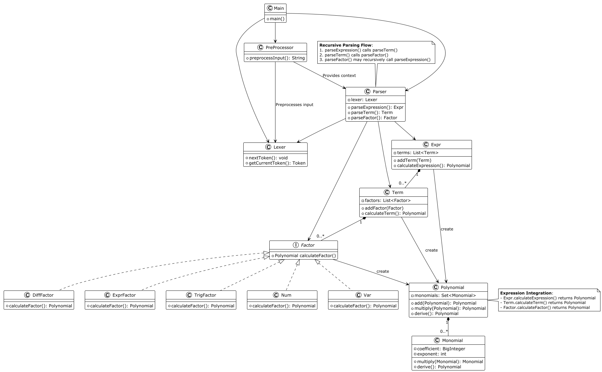

# 
  BUAA_2025_OO_Unit1 单元总结

本单元的核心任务是实现 __表达式展开与化简__.

---
## 程序结构分析

UML类图如下:

__这里仅针对部分核心的类分析,详细的统计数据见文末附录__
__这里仅做性能分析,关于类设计的考虑放在架构设计体验一节__
#### 1.分析指标
我选择了以下三个指标:
* **LCOM (Lack of Cohesion in Methods)**  : 评价代码的职责分配,高于1则证明可以切分类
* **CBO (Coupling Between Objects)**  : 评价类可重用性,建议较低  
* **RFC (Response for a Class)**  : 评价类设计复杂性,建议较低  

#### 2.分析与反思
通过这些数据,我认为我的代码有以下优缺点:
* 职责分配合理,符合高内聚:
  * 绝大部分类`LCOM`为 1, 仅有枚举类和`Token`类(不涉及核心代码)为 2
  * `TrigFactor`实现了两个三角函数,可能将它变为接口,分两个类实现更为合理
* 类间耦合较高:
  * Parser (CBO=13) --解析类
     * 直接依赖`Expr`, `Term`, `Factor`, `Lexer`等语法节点类和词法分析器,解析逻辑与具体语法类强绑定.
     * 这导致扩展新语法需修改Parser,可能需要引入抽象语法树接口`ASTNode`,解析器返回接口类型.
  * Polynomial (CBO=10) --计算类
    * 直接依赖的数据结构过多,可能为其封装一个`PolynomialOperations`工具类更为合适
  * ResFunction (CBO=1) --函数类
    * 仅依赖`HashMap`这一属性容器
    * 矛盾点: CSA=10(属性多)但CBO低,这意味着设计上存在 __长方法参数传递数据,而非直接依赖类__ 的问题
  * Expr (CBO=7) --关系类
    * 这些类的层次化设计与耦合性是合理的
* 有些类过于复杂,应拆分或引进工具类:
  * `Monomial` 和 `Polynomial`的行数和达到 300 行,`RFC`分别为 47 和 29,本质是因为它们内部完成了所有的运算和格式化输出.
  * PreProcessor (RFC=23):这是由自定义递推函数和自定义普通函数存在许多重复,而没有一个函数类统一,导致重复逻辑造成的.
* 如果需要优化,重构方案:
  * `Parser`:由工厂模式创建,即定义`ASTNode`抽象语法树,由`ASTNodeFactory`创建具体节点;由访问者模式隔离不同结点的解析行为
  * `Monomial`:拆分功能,将`toString`委托给`Formatter`,定义`Derivation`接口,实现具体的求导规则
  * `ResFunction`:可能需要彻底的重构,将函数视为因子更适合可能的扩展要求

---
## 架构设计体验
### 第一次作业
__任务简述__:
* 读入一个包含加、减、乘、乘方以及括号（其中括号的深度 __至多为 1 层__ ）的 __单变量__ 表达式，输出 __恒等变形展开所有括号后的表达式__

__架构设计__:
以递归下降解析为核心,将任务拆分成 __预处理,解析,计算,输出__ 四步,设计了解析类(`Parser Lexer`),关系类(`Expr Term Factor(interface) Var Num`),计算类(`Polynomial`)

### 第二次作业
__任务简述__:  
* 新增三角函数因子
* 新增自定义递推函数因子

__架构设计__:
* 设计了专门的`preProcesser`,目的为提前进行一次表达式分割,将自定义递推函数替换掉
* `Lexer`and`Parser`修改不大,新增三角函数解析
* `Operator`进行全面的重构,将`Polynomial`类改为拥有`HashSet<Monomial>`属性,`Monomial`类的属性由其形式决定:$mono = tx^a\prod sin^i(poly_k)\prod cos^j(poly_l)$
* `RecursiveFunction`:$f_{\{0-5\}}$都能够改写为$expr$,所以事先构造一个`ArrayList<String>`作为被替换的式子  

__体会__:
第二次作业的难度很大程度上来源与第一次糟糕的设计 Q_Q .
首先,由于第一次作业压根没有`Monomial`类,所以计算需要全面重构;其次,对于负号`-`的处理选用了一个标记符对关系类进行标记,这埋了一个大雷,如果未来负号含义改变就全得重写了(所幸这并没有发生).
现在回想,我认为第二次作业我选择的字符串替换也并不是一个好的方法,我需要额外考量替换后字符串的语法正确性,并可能因此增大计算开销.

### 第三次作业
__任务简述__:
* 新增自定义普通函数因子
* 新增求导算子

__架构设计__:
* `preProcessor`:提前进行分割,将自定义普通函数也替换掉
* 求导运算交给`Mono/Poly`轴处理

__体会__:
第三次作业迭代上困难不大,自定义普通函数就是弱化版的递推.可能不太一样的是,我没有采用课上实验的方法求导,而是将所有的运算相关交给计算类,我认为这样更满足职责拆分的需求.

### 类设计总结:
* 处理输入:`MainClass`
* 预处理类:`PreProcessor`,`ResFunction`,`SelfFunction`
* 解析类:`Lexer`,`Token`,`Parser`
* 关系类:`Expr`,`Term`,`Factor(interface)`,`Num`,`Var`,`ExprFactor`,`TrigFactor`,`DiffFactor`
* 计算类与输出处理:`Polynomial`,`Monomial`
总的来看,可以新增类处理输入输出,关系类在三角函数可能可以划分新层次

### 可扩展性分析
* __扩展为多变量__:为`Var`预留了`name`属性,在`Token`中也区分了`Type`和`content`,这使得我的代码兼容多变量较为容易
* __新增别的三角函数__:只有一个`TrigFactor`干了正弦和余弦两件事情,这其实是不合理的.如果新增正切等三角函数,则重构势在必行.
* __新增各类因子__:当下架构新增因子当然是可以的,但会进一步增加解析的复杂度,若新增因子过多肯定需要重构语法树,采用工厂模式.

---
## Bug分析与优化
本单元我将自己出现的bug归为两类:
* 回归测试未通过:因为第二次作业基本是全面重构,第三次作业修改了一些计算逻辑,导致我第三次作业还被类似`sin(0)^0`的测试点hack(
* 自测不全面导致连环爆:第一次和第二次作业都出现了核心逻辑有误的问题.
  * 第一次作业出错核心类:`Parser.parseFactor(boolean)` LOC:24 圈复杂度:8 ,标记符`reverse`更新逻辑出错
  * 第二次作业出错原因是对`Equals`方法的重写导致了合并失误
  * 我只能说是没搓测评机导致的

发现别人程序bug所采用的策略:
更多使用的是脑测 + 对他人进行代码走查

我进行的优化相当有限,仅限于合并同类项 -_- .

---
## 心得体会
#### 设计上的
1.在`Monomial`类的设计中,虽然将数学运算集中管理看似符合单一职责,但`derive()`和`toString()`方法的爆炸式增长让我意识到就算是单一职责,也需要更精细的颗粒度.
2.写的时候没啥感觉,统计才发现`Parser`类CBO=13,已形成"上帝类"雏形.
3.第二次作业因未覆盖`equals()`方法测试，导致合并同类项时出现严重错误.这让我意识到,高复杂度代码必须配备同等强度的测试,换句话说,__不要没事找事搞逻辑复杂的代码__.
4.好的架构非常重要(重构太痛苦了).

#### 课程体会上的
1.对"DDL是第一生产力"的再认识(疯狂星期六).
2.测评机是必要的,强测倒还好,就是hack环节就只能眼睁睁看着自己被刀.
3.感谢第二次作业的网络波动.
4.不过话又说回来了,这门课好像本意就是模仿工程实践,从这个角度看挺成功的,至于完成任务的成就感,或许下个单元会有吧.

---
## 未来方向
作业难度差异似乎有点大,第二次作业面临了重构和本身难度的双重压力，看到第二次作业的心情基本是：

关于互测,第三次互测对测试点的要求似乎过于严苛了(可能受到了第二次互测影响?),我们无法对求导因子的正确性有强度的hack

---
## 附录
__方法复杂度__

| Method                                                                                         | LOC | v(G)                    |
|------------------------------------------------------------------------------------------------|-----|-------------------------|
| DiffFactor.DiffFactor(Expr, boolean)                                                           | 4   | 1                       |
| DiffFactor.calFactor()                                                                         | 10  | 2                       |
| Expr.addTerm(Term)                                                                             | 3   | 1                       |
| Expr.calExpr()                                                                                 | 10  | 3                       |
| ExprFactor.ExprFactor(Integer, Expr, boolean)                                                  | 5   | 1                       | 
| ExprFactor.calFactor()                                                                         | 11  | 2                       | 
| Lexer.Lexer(String)                                                                            | 52  | 15                      | 
| Lexer.getCurToken()                                                                            | 3   | 1                       | 
| Lexer.isTokenEnd()                                                                             | 3   | 1                       | 
| Lexer.nextToken()                                                                              | 3   | 1                       | 
| MainClass.main(String[])                                                                       | 27  | 4                       | 
| Monomial.Monomial(BigInteger, int, HashMap<Polynomial, Integer>, HashMap<Polynomial, Integer>) | 9   | 3                       | 
| Monomial.clone()                                                                               | 11  | 3                       | 
| Monomial.comparable(Monomial)                                                                  | 5   | 3                       | 
| Monomial.derive()                                                                              | 56  | 8                       | 
| Monomial.equals(Object)                                                                        | 14  | 7                       | 
| Monomial.hashCode()                                                                            | 4   | 1                       | 
| Monomial.isZero()                                                                              | 3   | 1                       | 
| Monomial.merge(Monomial)                                                                       | 4   | 1                       | 
| Monomial.mergeMaps(HashMap<Polynomial, Integer>, HashMap<Polynomial, Integer>)                 | 8   | 1                       | 
| Monomial.multiply(Monomial)                                                                    | 7   | 1                       | 
| Monomial.toString()                                                                            | 58  | 17                      | 
| Num.Num(BigInteger, boolean)                                                                   | 4   | 1                       | 
| Num.calFactor()                                                                                | 13  | 3                       | 
| Parser.Parser(Lexer)                                                                           | 3   | 1                       | 
| Parser.parseDiffFactor(boolean)                                                                | 7   | 1                       | 
| Parser.parseExponent()                                                                         | 17  | 4                       | 
| Parser.parseExpr()                                                                             | 17  | 4                       | 
| Parser.parseExprFactor(boolean)                                                                | 7   | 1                       | 
| Parser.parseFactor(boolean)                                                                    | 24  | 8                       | 
| Parser.parseNum(boolean)                                                                       | 5   | 1                       | 
| Parser.parseTerm(boolean)                                                                      | 9   | 3                       | 
| Parser.parseTrigFactor(boolean)                                                                | 11  | 2                       | 
| Parser.parseVar(boolean)                                                                       | 7   | 1                       | 
| Polynomial.Polynomial(HashSet<Monomial>)                                                       | 3   | 1                       | 
| Polynomial.add(Polynomial)                                                                     | 23  | 7                       | 
| Polynomial.clone()                                                                             | 7   | 2                       | 
| Polynomial.derive()                                                                            | 9   | 2                       | 
| Polynomial.equals(Object)                                                                      | 11  | 4                       | 
| Polynomial.getComparableMono(HashSet<Monomial>, Monomial)                                      | 10  | 3                       | 
| Polynomial.hashCode()                                                                          | 4   | 1                       | 
| Polynomial.multiply(Polynomial)                                                                | 21  | 6                       | 
| Polynomial.power(int)                                                                          | 12  | 3                       | 
| Polynomial.toString()                                                                          | 11  | 3                       | 
| PreProcessor.parseBracketedContent(String, int)                                                | 20  | 5                       | 
| PreProcessor.preProcess(int, ArrayList<String>, int, HashMap<Character, String>, String)       | 14  | 4                       | 
| PreProcessor.replaceRes(String, ResFunction)                                                   | 22  | 4                       | 
| PreProcessor.replaceSelf(String, SelfFunction)                                                 | 21  | 4                       | 
| PreProcessor.simplify(String)                                                                  | 12  | 1                       | 
| ResFunction.ResFunction(HashMap<Character, String>)                                            | 7   | 1                       | 
| ResFunction.calFormatExpr(int)                                                                 | 23  | 3                       | 
| ResFunction.createFormatExpr()                                                                 | 10  | 2                       | 
| ResFunction.getReplaceFactor(String)                                                           | 21  | 6                       | 
| ResFunction.parseInitDef()                                                                     | 15  | 3                       | 
| ResFunction.parseLeft(String)                                                                  | 13  | 3                       | 
| ResFunction.parseResDef()                                                                      | 17  | 2                       | 
| ResFunction.parseRight(String)                                                                 | 38  | 7                       | 
| ResFunction.replace(int, String)                                                               | 11  | 2                       | 
| SelfFunction.SelfFunction(String)                                                              | 4   | 1                       | 
| SelfFunction.getName()                                                                         | 3   | 1                       | 
| SelfFunction.getReplaceFactor(String)                                                          | 21  | 6                       | 
| SelfFunction.parseSelfDef()                                                                    | 19  | 3                       | 
| SelfFunction.replace(String)                                                                   | 10  | 2                       | 
| Term.addFactor(Factor)                                                                         | 3   | 1                       | 
| Term.calTerm()                                                                                 | 11  | 3                       | 
| Token.Token(Type, String)                                                                      | 4   | 1                       | 
| Token.getContent()                                                                             | 3   | 1                       | 
| Token.getType()                                                                                | 3   | 1                       | 
| TrigFactor.TrigFactor(int, Factor, Trig, boolean)                                              | 6   | 1                       | 
| TrigFactor.calFactor()                                                                         | 16  | 4                       | 
| Var.Var(Integer, String, boolean)                                                              | 5   | 1                       | 
| Var.calFactor()                                                                                | 10  | 2                       | 

ps:LOC:代码行数 v(G):圈复杂度

__类/接口复杂度__

| Class           | CSA | Dcy | LOC | NOAC |
|-----------------|-----|-----|-----|------|
| DiffFactor      | 2   | 4   | 18  | 1    |
| Expr            | 1   | 3   | 16  | 2    |
| ExprFactor      | 3   | 4   | 21  | 1    |
| Lexer           | 2   | 2   | 65  | 3    |
| MainClass       | 0   | 5   | 29  | 1    |
| Monomial        | 4   | 1   | 185 | 6    |
| Num             | 2   | 3   | 21  | 1    |
| Parser          | 1   | 12  | 110 | 9    |
| Polynomial      | 1   | 1   | 114 | 5    |
| PreProcessor    | 0   | 2   | 91  | 5    |
| ResFunction     | 10  | 1   | 167 | 8    |
| SelfFunction    | 6   | 0   | 65  | 4    |
| Term            | 1   | 3   | 17  | 2    |
| Token           | 2   | 1   | 14  | 2    |
| Token.Type      | 13  | 0   | 3   | 2    |
| TrigFactor      | 4   | 4   | 28  | 1    |
| TrigFactor.Trig | 4   | 0   | 3   | 2    |
| Var             | 3   | 3   | 20  | 1    |

ps:CSA:属性数 Dcy:依赖数 LOC:代码行数 NOAC:新增方法

| Interface                                                                                      | ISA | LOC                     | 
|------------------------------------------------------------------------------------------------|-----|-------------------------|
| Factor                                                                                         | 0   | 3                       | 

ps:ISA:属性数 LOC:代码行数 

__内聚/耦合度量__

| Class           | CBO | LCOM                    | RFC |
|-----------------|-----|-------------------------|-----|
| DiffFactor      | 5   | 1                       | 10  |
| Expr            | 7   | 1                       | 11  |
| ExprFactor      | 5   | 1                       | 10  |
| Factor          | -   | -                       | 1   |
| Lexer           | 4   | 1                       | 14  |
| MainClass       | 5   | 1                       | 17  |
| Monomial        | 8   | 1                       | 47  |
| Num             | 4   | 1                       | 8   |
| Parser          | 13  | 1                       | 24  |
| Polynomial      | 10  | 1                       | 29  |
| PreProcessor    | 3   | 1                       | 23  |
| ResFunction     | 1   | 1                       | 28  |
| SelfFunction    | 1   | 1                       | 17  |
| Term            | 5   | 1                       | 11  |
| Token           | 3   | 2                       | 3   |
| Token.Type      | 3   | 2                       | 2   |
| TrigFactor      | 5   | 1                       | 10  |
| TrigFactor.Trig | 2   | 2                       | 2   |
| Var             | 4   | 1                       | 7   |
