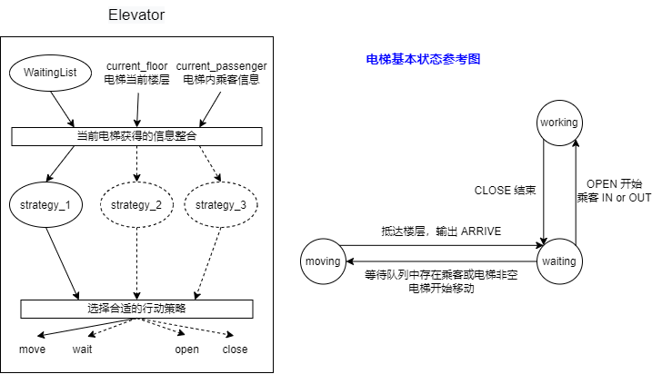

# 任务描述
* 目的选层电梯
* 运行流程:
  * 进入电梯前,乘客输入目标楼层;
  * 系统根据设定的策略指定最合适的电梯服务,将结果告知乘客;
  * 乘客进入指定电梯后,无需再次按楼层按钮,电梯自动将其送至目标楼层.
* 优先级指数描述客户到达目的楼层的紧迫程度
* 系统从标准输入中读取乘客请求信息,__请求调度器__ 分配请求给某部电梯,被分配的电梯 __上下行,开关门,乘客进入/离开电梯__ 等动作运送乘客
* 请求输入给出官方包,调用官方接口输入输出
* 单部电梯的运行策略与电梯系统的调度策略均可任意指定,只要在规定时间内运送所有乘客即可

### 官方包说明
* 使用说明
  * 程序的输入输出为实时交互,评测机可以做到在某个时间点投放一定量的输入.
  * 不需要考虑由于调用输入输出接口导致的时间上的差异,可以认为准时投放请求和输出相关内容.
  * 不需要对输入输出接口进行修改.

### 正确性约束
电梯系统默认参数:
* 可到达楼层:地下B4-B1,地上F1-F7,共11层
* 初始位置:F1
* 数量与编号:6部,id为1-6
* 移动速度:0.4s/层
* 限制乘坐人数:6人 (任何时刻,哪怕电梯并未移动)
* 开关门:间隔不小于0.4s  

运行时约束:
* 电梯符合物理规律,初始时/移动时/结束时必须关门;
* 乘客是正常人类,开门时进出电梯不花时间;乘客可以中途下电梯
* 时间应正常流逝,系统结束时所有乘客的请求均满足
* (本次作业)乘客不能转乘电梯

输入格式:
`[时间戳]乘客ID-PRI-优先级指数-FROM-起点层-TO-终点层-BY-指定的电梯ID`

输出格式:
* 电梯到达某位置:`[时间戳]ARRIVE-所在层-电梯ID`
* 电梯开门:`[时间戳]OPEN-所在层-电梯ID`
* 电梯关门:`[时间戳]CLOSE-所在层-电梯ID`
* 乘客进入电梯:`[时间戳]IN-乘客ID-所在层-电梯ID`
* 乘客离开电梯:`[时间戳]OUT-乘客ID-所在层-电梯ID`

### 性能分
归纳下来,即:
* 运行时间尽量短
* 尽量满足乘客请求的优先级
* 尽量减少系统的无效运行

# 思路分析

* __Hint:__
电梯运行策略实质是从一组待选任务中方选取一个执行.可先写一个 __候乘表类__ 来表示当前电梯系统中各层等待电梯服务的乘客.编写一个 __策略类__ ,接受该候乘表类,分析并返回一个目标动作(开关门/上下行).从而将分析过程隐藏在策略类内部.
策略类实例对象是电梯的属性,通过更换策略类来切换执行策略.或者用工厂模式组装不同电梯
电梯的运行流程:到达一层 &rarr; 开门 &rarr; 乘客进出 &rarr; 关门 &rarr; 寻找下一个目标层 &rarr; 移动.使用状态模式建模.

---
线程设计:
* `InputThread` 接受官方包,包含对`RequestTable`的引用
* `MainDispatcher` 包含对`RequestTable`和`SubRequestTable`容器的引用,作用是把乘客请求分配给具体电梯
* `Elevator`电梯的双层含义,既是静态类也是线程,拥有它的`SubRequestTable`属性.

---
官方包使用:
`PersonRequest`:
方法:getFromFloor getToFloor getPersonId getPriority getElevatorId 
重写:toString(格式化输出) HashCode equals
`ElevatorInput`:
构造函数:ElevatorInput(InputStream inputStream)
方法:close nextRequest
`TimableOutput`:
TimableOutput.initStartTimestamp 初始化 
TimableOutput.println(String.format(...)) 格式化输出,自动在开头打上时间戳

---
电梯类`Elevator`设计:
电梯要做两件事,搞清楚自己要做什么 和 怎么做自己要做的
* 电梯行为:
  * 状态模式 : 一个对象 , 存在多个状态 , 状态可以相互转换 ; 不同状态下 , 行为不同 ;
    * Context : 持有当前状态对象的引用,并将与状态相关的请求委托给该状态对象.
    * State : 状态接口定义了状态对象需要实现的一系列方法,通常这些方法对应于上下文中不同的操作.
    * ConcreteState : 实现状态接口的具体类,每个具体状态封装了对应状态下的行为.
  * 使用方法:
    * 定义状态接口 : 将电梯所有状态下的行为抽象成一个接口.
      * DoorOpen
      * DoorClose
      * MoveUp
      * MoveDown
      * PassengerIn
      * PassengerOut
      * ArriveFloor
    * 实现具体状态类 : 为电梯的每个状态实现状态接口,封装该状态下的具体行为逻辑.
      * moving : 允许ArriveFloor
      * waiting : 允许 DoorOpen 和 Move..
      * working : 允许 DoorClose 和 Passenger..
    * 上下文持有状态对象 : 电梯作为上下文对象,包含一个状态对象的引用,根据当前状态调用对应状态对象的方法来执行操作.
    * 状态切换 : 在具体操作中,根据条件和逻辑决定状态转换,并将上下文的状态引用指向新的状态对象.

* 其他属性(部分) : 
  * 全局属性:
    * capacity
    * speed
    * topFloor
    * bottomFloor
  * 静态属性:
    * id
    * strategy
  * 动态属性:
    * requestTable
    * state
    * currentFloor
    * direction
    * currentPassenger
    * waitingPassenger
    * direction

* 电梯意图:
  * LOOK策略:若当前电梯处于移动状态(即有方向),它会一直按同一方向运行,直到没有让它继续保持这个方向的条件(前面仍有乘客，乘客需要在前面下电梯),它就会立即转向或停层.
  * 单部电梯采用LOOK策略,本次作业无需考虑分配给具体电梯
  * 以后可以采用这种策略,即搜寻近的,运动方向相同的电梯分配;若均反向运动,交给目前电梯里请求最少的.
  * ps:这个设计里完全没考虑优先级的问题i _i

# 后续更改
* 取消内部类,改为直接与waitingPassenger关联
* waitingPassenger改用线程安全的容器
* 应拆分出Strategy,减少Elevator代码量
* 应拆分出Passenger,用线程安全的Set
* 适当处改为使用优先级
* 互测未能进入 T_T