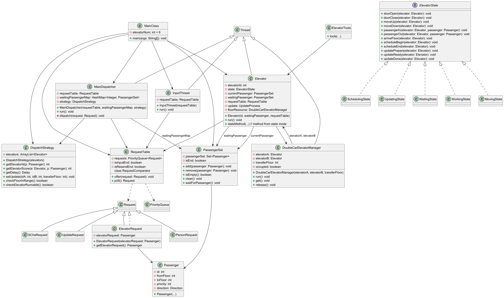
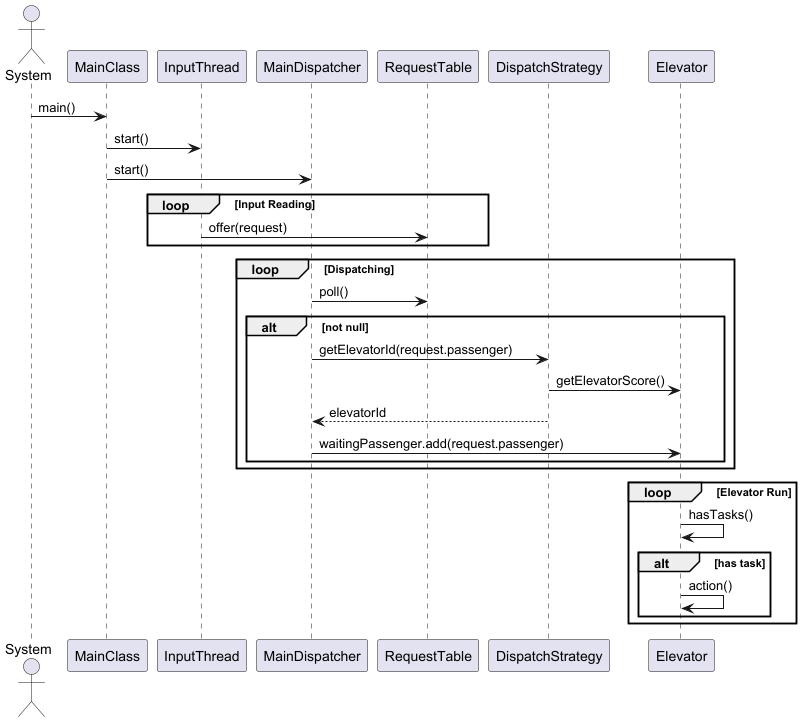

# <center>  BUAA_2025_OO_Unit2 单元总结</center>

本单元以电梯选层为背景，考察多线程交互逻辑、调度器的实现等。

---

## 同步块、锁与调度器设计
### 同步块与锁
同步块、锁的意义是解决竞争与同步问题。
本单元中，我没有使用Java封装的锁，仅使用`synchronized` 解决同步问题。

`synchronized`有以下三种用法：
获得当前对象实例的锁
```
synchronized void method() {
    ...;
}
```
获得当前类的锁
```
synchronized void static method() {
    ...;
}
```
获得当前对象的锁
```
synchronized(Object) {
    ...;
}
```
理论上，三种同步的用法都能用于解决本单元的问题。我的思路是： __在“托盘”中使用第一种同步，涉及到运行逻辑的同步采用第三种同步，且确保只给“托盘”加锁__。这样做的好处是：
* “托盘”的所有操作都是线程安全的
* 电梯、调度器等只获取“托盘”的锁，由于“托盘”的共享属性，进程间的交互会更容易
* 同步代码块控制是细粒度的，灵活性更强，扩展性更高，也有助于避免非预期的锁竞争

---

### 第五次作业
本次作业模仿上机实验的写法，构建了`InputThread-RequestTable-MainDispatcher-WaitingPassenger-Elevator`的生产者-消费者模型。
电梯调度采用`Look`策略，电梯采用状态模式建模。
本次作业指定电梯，无调度策略。

### 第六次作业
本次作业新增临时调度请求、放开电梯指定约束。
本次作业在同步块和锁的选择上无变化。代码架构上，将`RequestTable`优化为 __线程安全的优先级队列__ ，确保`ScheRequest`的优先分配；新增`ElevatorRequest`作为电梯发还给调度器的请求。
调度策略：采用了一种类似于影子电梯的打分系统，具体来说，有以下几个方面：
* 距离分: 评估接到乘客的运行楼层期望，考虑到影子电梯的计算不太符合生活，我对距离的评估是一种平均情况
* 载重惩罚:评估电梯的请求总数，候乘表与电梯内人数越多，越倾向于不接收请求
* 延迟设置:获取请求后延迟分配,防止大量临检导致多请求进入同一电梯
对于电梯而言，临检请求实质是一个原子操作，所以我在状态中新增`SchedulingState`进行处理。
这一调度策略在强测的表现不错，但并没有与平均分配/随机分配在性能分上拉开差距。

### 第七次作业
本次作业新增双轿厢改造请求，我对这个任务的理解是三个部分：保证`UpdateRequest`执行时序正确（单部电梯而言，释放请求的时机等）、线程安全（两部电梯，同步改造的进度）；保证改造后双轿厢电梯不相撞。
同步方面，新增了一个`DoubleCarElevatorManager`类管理一个双轿厢电梯，它负责两件事情：__继承`Thread`以同步改造请求__ 、 __持有Floor资源以控制电梯不相撞__
调度器方面，新增对速度、跨目标楼层请求的考虑。但由于打分设置没有细究，这种调度策略表现并不够稳定（强测中，部分测试点能达到98分，但也有91分的）

---

## 架构模式
第三次作业的UML类图如下。（省略了部分方法属性）


* 架构设计的变化前文已经提及
* 电梯采用状态模式建模，电梯只会特定的动作，仅由当前电梯的状态决定下一步动作
* 封装了`PassengerSet`提供给候乘表和电梯当前内乘客
* `MainDispatcher`管理`DispatchStrategy`，后者提供分配到的电梯id、创建双轿厢的方法
* `DoubleCarElevatorManager`作为线程，对两电梯的改造进程进行同步；作为资源，被两电梯互斥地持有
* 所有的输出由`ElevatorTools`完成
* 关于扩展性：
  * 对于可能的新请求类型，可以通过继承Request-更新RequestTable-创建电梯新状态解决
  * 对于可能的输出要求，通过编辑封装在`ElevatorTools`中的`formatOutput()`实现
  * 在电梯类中封装了`waitWaitingPassenger`、`notifyWaitingPassenger`和`notifyRequestTable`等方法，从而实现了细粒度的控制，也便于后续扩展

UML协作图如下：（省略了电梯内的控制逻辑）



### 迭代分析
稳定的内容：
* 电梯的运行逻辑不变
* 整体架构保持生产者-消费者模型
* 加锁的对象始终为托盘
易变的内容：
* 调度策略随着需求增多而调整
* 虽然整体保持生产者-消费者模型，但请求类型添加后，电梯也作为生产者出现
* 电梯的状态随需求增多而增多

### 双轿厢改造
正如前文提到的，采用`DoubleCarElevatorManager`处理改造请求、管理双轿厢电梯。
* 电梯关于update的状态有四个,未开始,准备,进行和已结束。所以时序与同步为：
  * 接收`UpdateRequest`，创建一个`manager`
  * `manager`对两个电梯发出准备信号，电梯进入`UpdatingState`，清空内部乘客，发回`ready`信号
  * `manager`每隔一定时间间隔，检查两电梯是否都已准备；准备后发出开始信号，电梯释放候乘表后进入等待
  * `manager`等待一定时间后，发出结束信号，电梯被唤醒并继续工作
* 双轿厢电梯防撞，是通过互斥持有目标楼层资源实现的
  * 进入目标楼层前，获取楼层资源
  * 离开目标楼层后，释放楼层资源

---

## bug分析与反思
### 第五次作业
这次作业出现了惨痛的错误，同步代码块将电梯运行所有代码括进来，导致电梯有请求时候乘表被锁，一次仅能运送一个乘客

### 第六次作业
这次作业强测无bug，互测因为我在多电梯处于临检时设置了延迟，导致了另一个临检请求到来时，用时超过6s和arrive次数超过2
debug方法主要是使用测评机跑随机数据加手动println观察

### 第七次作业
本次作业存在很多bug，但是许多问题相互耦合，糊过去不少测试点，互测被发现的bug与强测一致
这些bug出现的主要原因都是timing把握不当，比如输出arrive和获取目标楼层资源细微时间差，导致出现相撞，这些问题最终通过封装为原子操作和设置延迟解决了
debug的方法同上
---

## 心得体会
线程安全方面，我认为我对同步的理解实现了从“能不加就不加”，到“为了线程安全多加一些”到“封装方法，在该加的时候加”的转变。同时，在同步块内尝试获取别的资源是危险的，在本单元作业中我避免了出现这样的代码。如果后续还有扩展，我认为我的代码需要增加原子性来防止进程协作间的问题，并可能要将容器变为线程安全的。
层次化设计方面，我自认为做的还不错，建立的生产者-消费者模型架构三次作业保持了稳定，没有架构的重构。