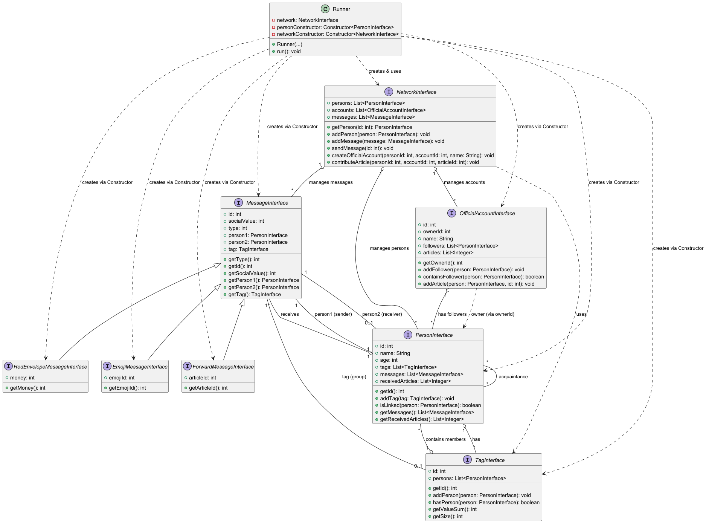
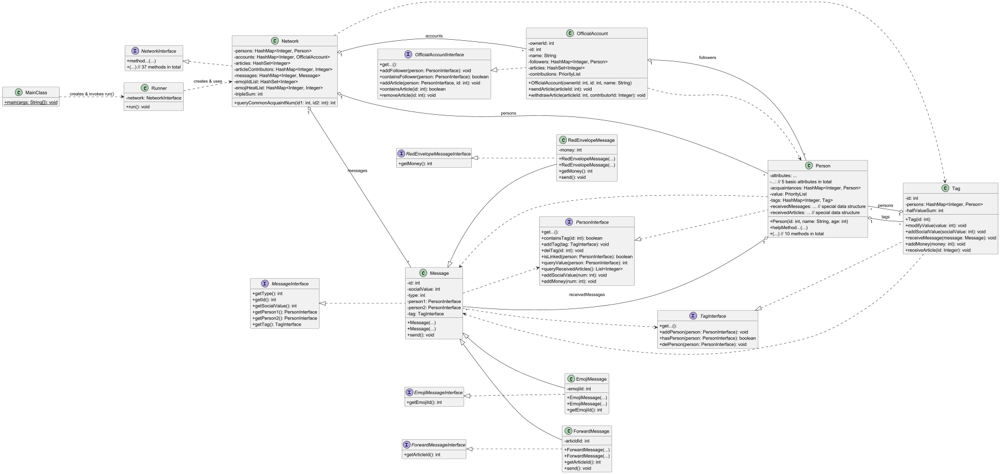

# 
  BUAA_2025_OO_Unit3 单元总结

本单元的核心任务是学习 __规格化开发__ , 理解 JML 语言并完成相关实现; 同时针对一些方法设计测试.

---

## 测试过程

### 对测试的理解
| 测试类型     | 定义 / 关注点                                   | 目的                                       | 测试对象                              | 通常阶段                     |
| :----------- | :---------------------------------------------- | :----------------------------------------- | :----------------------------- | :--------------------------- |
| **单元测试** | 对程序中最小的可测试单元进行测试                | 确保代码的每个独立部分按预期工作             | 单个函数、方法、类                       | 开发早期,编码时             |
| **功能测试** | 根据需求规格,测试软件的各项功能是否符合预期      | 验证软件是否实现了客户所需的功能,符合行为规范 | 软件的特性、功能模块（基于需求） |  开发中/后                    |
| **集成测试** | 测试不同模块组合在一起时是否能协同工作          | 发现模块间接口调用和交互的问题             | 多个相互关联的模块或子系统     |  单元测试后,系统测试前       |
| **压力测试** | 在超出正常工作条件下的稳定性、可靠性、性能表现 | 找出系统瓶颈,确定最大负载能力             | 整个系统或关键服务（极端负载下） |  开发后期,发布前             |
| **回归测试** | 修改代码后,重新运行已有测试用例                | 确保修改没有引入新错误或破坏原有功能         | 已通过的测试用例（单元/集成/功能） |  代码修改后,持续进行         |

分析解释:
1.  软件测试活动可以用一个金字塔来形象化. 最底层和最宽的是单元测试, 数量最多, 成本最低, 执行最快; 中间是集成测试; 顶层是端到端测试(是功能测试的一种), 数量较少, 成本较高, 执行较慢.
2.  单元测试一般是白箱测试, 而其他的测试更多是黑箱测试; 功能测试可以是全局的, 也可以是细粒度的; 压力测试和性能测试等通常是独立的类别或包含在系统测试层面进行; 回归测试则可以跨越所有层级, 是对已有测试用例的重复执行.

### Junit测试与数据构造的策略

根据这三次作业的具体实践来讲:

#### 第九次作业
目标是为方法 `queryTripleSum` 设计测试. 这个方法有这些特点:
    * `pure` 方法
    * 调用该方法本身不涉及任何异常抛出
    * 所依赖的同样是不涉及任何异常抛出的方法

我设计的测试方法为:
* __testInitialTripleSumZero__ :测试空图
* __testSingleTriangleFormation__ :测试逐步添加三条边形成一个三角形的情况
* __testMultipleTrianglesCompleteGraph__ :测试完全图
* __testAddEdgeCreatesTwoTriangles__ :测试添加边导致增加三角形的情况
* __testEdgeRemovalDecreasesTriangles__ :测试删除边导致减少三角形的情况

#### 第十次作业
目标是为方法 `queryCoupleSum` 设计测试. 这个方法有这些特点:
    * `pure` 方法
    * 调用该方法本身不涉及任何异常抛出
    * 所依赖的方法 `queryBestAcquaintance` 涉及异常抛出, 通过本方法的前置条件保证调用时不抛出异常
    * 由于 __仅针对 `queryCoupleSum` 设计测试__ , 我们应当假定 `queryBestAcquaintance` 被正确实现,也就是说, 测试这个被调用的方法的正确性是无必要的.

我设计的测试方法(冗余方法整合后简述)为:
* __针对 `queryBestAcquaintance` 的测试__ :这是毫无必要的, 只不过意识到这一点之后也懒得删去了
* __testQueryCoupleSumEmptyNetwork__ :测试无人的空图
* __testQueryCoupleSumNoCouples__ :测试有人无关系的空图; 和先前存在关系,但随后均被删除的图
* __testQueryCoupleSumSingleCouple__ :测试简单的一对关系
* __testQueryCoupleSumWithAddAndRemoval__ :混合测试功能, 一些增删关系对该值的影响
* __testQueryCoupleSumWithSameValue__ :混合测试功能, 同value时最佳好友应当是id最小的
* __testQueryCoupleSumIsPure__ :测试方法纯净, 具体的操作路径是设计逻辑上的深拷贝(完全创建一个新的图和新的人,但这些人具有完全相同的属性), 对比原图执行方法后与克隆图.

#### 第十一次作业
目标是为方法 `deleteColdEmoji` 设计测试. 这个方法有这些特点:
    * 有明确的被修改列表,需要考虑它们是否被合适地修改
    * 调用该方法本身不涉及任何异常抛出

我设计的测试方法为:
* __辅助方法`bumpHeat`和`addEmojis`__ :前者通过反复 `addMessage` 和 `sendMessage` 刷取合适地热度, 后者接受两个数组, 表征emojiId和heat, 从而能够创建我需要的对应的热度的表情.
* __testEmptyList__ :测试空列表
* __testLimitZeroKeepsAll__ :测试limit为0情况
* __testNegativeLimitKeepsAll__ :测试limit为负数情况
* __testLargeLimitRemovesAll__ :测试limit足够大情况
* __testMixedRemovals__: 混合测试
* __遗漏之处__ :现在回顾,我的设计仅保证了"所有EmojiMessage被正确删去或保留", 而并没有针对"任何非EmojiMessage均需要被保留" 进行测试

#### 数据构造技巧总结

1.  **构造基本/边界状态:**
    * **零元素/空集合:** 测试方法在处理没有任何元素(如 网络中没有 Person, 没有 Emoji, 没有 Message)的状态时的行为.
    * **最小可操作单元:** 构造包含刚好能够触发某个核心逻辑所需的最小数量元素的集合.(如 queryTripleSum 需要 3 个 Person 才能构成三角形).
    * **边界值:** 构造输入参数(如 limit)或内部数据(如关系 value, Emoji heat)在其有效范围的最小值, 最大值, 以及靠近边界的点的值(如 deleteColdEmoji 的 limit 为 0, 负数, 极大值); 或者较为特殊的图结构(如完全图).

2.  **构造特定逻辑路径和分支的状态:**
    * **“快乐路径”状态:** 构造代表典型, 预期使用场景的状态, 验证方法在正常情况下的行为.
    * **异常/错误路径状态:** 构造违反方法前置条件或预期会触发异常的状态.(如 queryBestAcquaintance 的 Person 不存在, Person 没有熟人状态, 尽管这次作业中是无必要的).
    * **条件分支覆盖:** 构造能够使方法中的各种 if/else, switch 等条件语句走向不同分支的状态.(如 deleteColdEmoji 中, 通过调整 Emoji 热度, 使 heat >= limit 条件对不同的 Emoji 产生 true 或 false).
    * **循环边界和迭代次数:** 构造使方法内部的循环执行零次, 一次, 多次, 以及达到循环的边界条件 (如 处理列表的第一个或最后一个元素)的状态.
    * **关键数值特殊判断:** 构造阈值附近, 相等或其他会引发并列情况的数值.(如 queryBestAcquaintance 中, 设置多个熟人具有相同的最高 Value; deleteColdEmoji 中, 设置热度等于 limit).

3.  **构造动态变化的状态:**
    不仅仅测试静态的网络状态, 而是构造一个包含一系列操作的状态序列. 在这些操作之间调用被测方法, 验证其在状态变化过程中的行为是否正确.(如在 queryTripleSum 测试中, 添加/删除一条边后验证三角形数量的变化).

4.  **构造用于验证副作用的状态:**
    对于非纯函数(如 deleteColdEmoji), 构造状态并在方法调用后, 详细检查所有 JML assignable 子句中列出的集合或属性是否按 JML ensures 子句的规定被正确修改.对于纯函数也要检查其他属性是否被更改.

5. **构造测试数据顺序:**

* 从**简单到复杂**:先测试空, 单元素, 边界等简单情况.
* 从**静态到动态**:先测试固定状态下的结果, 再测试状态变化后的结果.
* 从**正常到异常**:覆盖典型的正确输入, 也要覆盖会导致异常或特殊处理的输入.
* 关注**边界值和关键值**:输入参数和内部数据的阈值, 边界值, 会引发并列的数值等.
* 验证**输入输出**, 也要注意验证**状态变化**.
* 慎用**单纯的随机生成**数据测试: 许多极端情况不是随机生成随机数据能检查到的,它应当用于压力测试等场合(显然与我们本单元任务不太适配).

---

## 大模型的使用与引导

实际上, 大模型理解 JML 的能力很强, 主体的理解上基本上不会有问题(当然要它写代码就会在不知名的小角落上塞些乱七八糟的东西), 所以我主要是用大模型辅助检查与优化代码. 关于检查和优化, 在一些方面和细节上会出岔子:

1. 会相当机械地遵守 JML 规格, 哪怕已经引导过只需要满足 JML 规格的限制, 而具体的实现是灵活的(如明确指出 JML 规格只是抽象模型状态, 而不干涉内部实现细节), 大模型仍然不会写出"直观上"违反 JML 规格的代码, 比如编写 `Person` 类的 `queryReceivedArticles()` 方法时, 我采用了一种"设置脏位-读时更新"的策略, 而大模型始终认为这是违反 JML 规格中 `pure` 规则的行为.
2. 面对长对话容易猪脑过载, 比如针对一个方法需要两处大的优化, AI会出现忘记一个已经被调整过的优化. 解决办法为同步每次优化, 或者专门进行一次输入, 要求AI重新回顾前面的对话, 明确已经进行的一些优化.
3. AI似乎有过于强烈的增加辅助方法/辅助类倾向. 在使用AI辅助选择数据结构的时候, 一旦我提到过有效率需求, AI就倾向于创造一个新的辅助数据结构.

---

## 架构设计与性能优化

### 关于架构设计
先给出一个UML类图展示框架.官方包大概长这样:

确实有点乱,融合了我的实现后更乱了,于是我经过了一些调整得到如下:

简单来说, 本单元的架构是:
* 创建一个唯一的 Network 所有的指令针对它进行
* 实现了 Person Tag OfficialAccount Message 四个类, 其中 Message 有三个子类
* 围绕人际关系, 文章和消息展开

### 关于维护策略和性能
这部分涉及的是按照 JML 规格给出"实现"会复杂度较高的方法, 整理如下:

#### 1. `isCircle` 与 `queryShortestPath`
有很多同学在 `isCircle` 采用了 __并查集__ , 但是 `queryShortestPath` 似乎只能BFS实现. 而且, 当频繁出现关系删除的时候, 并查集表现并不算太好.
所以我选择直接采用 __双端BFS__ .

#### 2. `queryTripleSum`
动态维护一个 `tripleSum` 变量, 它初始为0, 只被 `addRelation` 和 `modifyRelation` 修改, 具体实现是构建一个辅助方法 `queryCommonAcquaintNum` , 返回当前两人的共同好友数.
这样, 查询复杂度 $O_{(1)}$ , 关系相关的复杂度 $O_{(n)}$ .考虑到 `addRelation` 和 `modifyRelation` 未来可能继续动态维护其他变量, 这样做是很值得的(它们未来可能变成 $O_{(2n)}$ , 变化不大, 但所有的查询都是 $O_{(1)}$ )

#### 3. `queryTagValueSum`
本来以为这个也就 $O_{(n^2)}$ 贪一下没事的, 结果被狠狠爆了.
在 `tag` 里面动态维护一个 `halfValueSum` (由于 Relation 是对等的, 所以可以这么做), `Network` 有两处可能修改它, 即`addRelation` `modifyRelation` , 具体维护不再展开讲.

#### 4. `queryReceivedArticles` 和 `queryReceivedMessages`
这里要求返回最近的 5 条文章/消息, 以消息为例, 我选择采用的是用一个 `LinkedHashSet<Message> receivedMessages` 和 `LinkedList<Message> recentMessages` 来存储.它的复杂度分析如下(Message无删除,但是举例方便就这么写了):

操作 | receivedMessages | recentMessages 
:---: | :---:              | :---:
__插入头部__ | 链表, $O_{(1)}$ | 可能要删尾部, 链表, $O_{(1)}$
__按内容删除__ | 哈希, $O_{(1)}$ | 由于大小固定, 可认为$O_{(1)}$
__查询全部__ | 本单元未使用, $O_{(n)}$ | 由于大小固定, 可认为$O_{(1)}$

当第十次作业这样修改完之后我一度以为自己找到了天才的数据结构, 然后发现第十一次作业允许文章出现 id 重复...

不过想到理论课荣文戈老师经常提到的一句话 _上一个程序员出的bug,要修就多封装一层_ . 于是我的最终的解决方案是:保留原有代码, 然后设计一个 `static int articleCount` 作为 `internalId` , 然后建立一个双向映射图,从而实现了复杂度不增的支持重复元素兼容.

当然, 听说直接用 `ArrayList` 相信编译器优化也能通关.

#### 5. `queryCoupleSum` 和 `queryBestAcquaintance`
同样是希望动态维护一个 bestAcquaintance .

我考虑到 `bestContributor` 完全类似, 于是造了一个新的数据结构 `PriorityList` :
* 这个优先级列表用 `TreeSet<Pair> set= new TreeSet<>(comparator)` 存储 `<id, value>` , `comparator` 依照 best 的规则实现. 
* 再依靠一个 `HashMap<Integer, Pair> firstToPairMap` 实现高效查找. 
* 对外提供 `addPair` `removePairByFirst` `getFirstPair` `getSecondByFirst` `modifySecondByFirst` 方法.

### 关于规格与实现分离

我认为, 规格与实现分离本质上是一种 __"契约"__ : 规格设计者和代码实现者签订契约; 设计者确保多份契约之间相互兼容, 只要所有契约被严格遵守就能保证功能正确; 实现者保证每一份契约被正确履行; 最终合成一份功能正确的工程.

规格化设计是有很多好处的, 在这次作业中有所体现:
* 降低耦合度: 
  * 规格定义了模块清晰的边界, 不同的模块只需要关心对方的规格, 而不关注它的内部实现
  * 只要新的实现遵循相同的规格, 我们就可以用新的实现替换旧的实现, 而不会影响到依赖该规格的其他模块
* 提高可维护性:
  * 当需要修改一个模块的实现时, 只要不改变其对外规格, 其他依赖该规格的模块就不需要做任何修改
  * 清晰的规格使得开发者更容易理解模块的功能, 而不需要深入到复杂的实现细节中
* 增强可复用性:
  * 定义良好的规格, 比如通用的接口, 可以被多种不同的实现所满足
* 提升抽象层次:
  * 规格本身就是一种抽象. 它隐藏了不必要的实现细节, 让使用者可以专注于更高层次的逻辑和交互, 而不用关心底层是如何工作的
* 方便测试:
  * 我们可以针对规格(接口)编写测试用例
  * 在单元测试中, 当一个模块依赖于另一个模块时, 我们可以使用一个符合依赖模块规格的 Mock 对象来替代真实的实现, 从而隔离被测试模块

当然, 一个事物肯定有好有坏, 规格的最大坏处就是, 设计一个好的规格很可能必实现一个能用的代码更加复杂. 而且, 当逻辑足够复杂时, 如 JML 这样比较死板的规格, 可读性会特别差, 甚至不如实现的代码容易理解, 本单元进行到第三次作业时, `NetworkInterface` 来到了 700 多行, 而代码实现一般却在 500-600 行之间.

--- 

## 单元学习体会

诚实的讲, JML 很可能是一门这辈子只在这里用一次的语言. 这个语言集可读性差, 简洁性低于一身, 绝对的准确性这一优点也会因为设计规格本身过于复杂而难以保证(这一点从本单元官方包/指导书反复被修改就可以看出)被埋没...不过话又说回来了, 既然助教给了 JML 让我用, 规格有总比没有好.

不过本单元毕竟不完全是学习这个语言, 正如本总结前面提到的诸多内容, 其实早就脱离了 JML 这个语言, 我至少有以下收获:
* 了解并实现了"契约"式编程, 并由此加深了对"低耦合高内聚"的认知
* 掌握了一些测试数据设计的技巧, 并由此衍生出了一些debug的思路
* 提升了大模型的使用能力

总之, 这与电梯单元一样是一个难忘的单元.