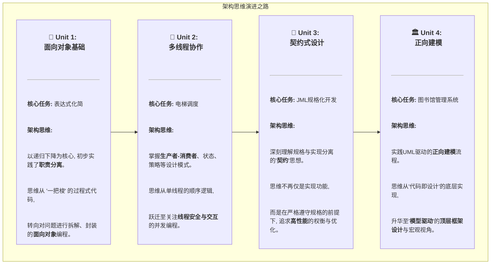

```mermaid
graph TD
    subgraph "架构思维演进之路"
        direction LR

        U1["<h3>🚀 Unit 1: <br> 面向对象基础</h3>
            <hr>
            <div style='text-align: left;'><strong>核心任务:</strong> 表达式化简<br></div>
            <div style='text-align: left;'><strong>架构思维:</strong><br></div>
            <div style='text-align: left;'>以递归下降为核心, 初步实践了<strong>职责分离</strong>。<br></div>
            <div style='text-align: left;'>思维从 '一把梭' 的过程式代码, <br></div>
            <div style='text-align: left;'>转向对问题进行拆解、封装的<strong>面向对象</strong>编程。</div>
            "]

        U2["<h3>🚦 Unit 2: <br> 多线程协作</h3>
            <hr>
            <div style='text-align: left;'><strong>核心任务:</strong> 电梯调度<br></div>
            <div style='text-align: left;'><strong>架构思维:</strong><br></div>
            <div style='text-align: left;'>掌握<strong>生产者-消费者</strong>、状态、策略等设计模式。<br></div>
            <div style='text-align: left;'>思维从单线程的顺序逻辑, <br></div>
            <div style='text-align: left;'>跃迁至关注<strong>线程安全与交互</strong>的并发编程。
            </div>"]

        U3["<h3>📜 Unit 3: <br> 契约式设计</h3>
            <hr>
            <div style='text-align: left;'><strong>核心任务:</strong> JML规格化开发<br></div>
            <div style='text-align: left;'><strong>架构思维:</strong><br></div>
            <div style='text-align: left;'>深刻理解规格与实现分离的'<strong>契约</strong>'思想。<br></div>
            <div style='text-align: left;'>思维不再仅是实现功能, <br></div>
            <div style='text-align: left;'>而是在严格遵守规格的前提下, 追求<strong>高性能</strong>的权衡与优化。
            </div>"]

        U4["<h3>🏛️ Unit 4: <br> 正向建模</h3>
            <hr>
            <div style='text-align: left;'><strong>核心任务:</strong> 图书馆管理系统<br></div>
            <div style='text-align: left;'><strong>架构思维:</strong><br></div>
            <div style='text-align: left;'>实践UML驱动的<strong>正向建模</strong>流程。<br></div>
            <div style='text-align: left;'>思维从'代码即设计'的底层实现, <br></div>
            <div style='text-align: left;'>升华至'<strong>模型驱动</strong>'的<strong>顶层框架设计</strong>与宏观视角。
            </div>"]
    end

    U1 --> U2 --> U3 --> U4
```