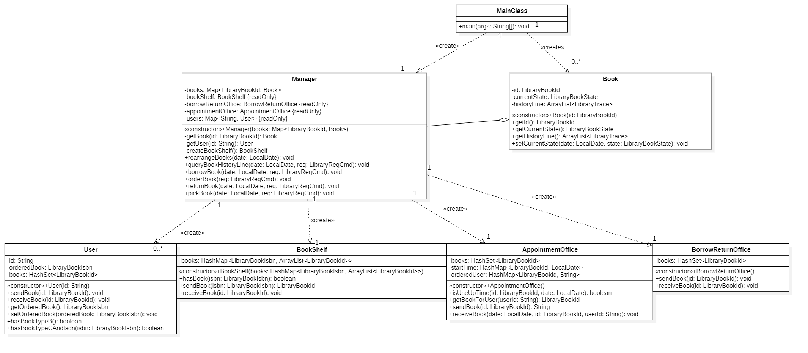
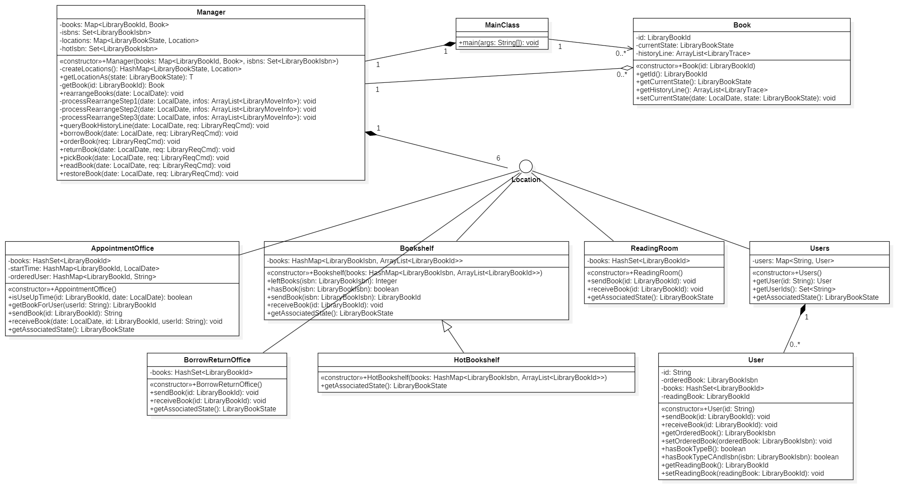
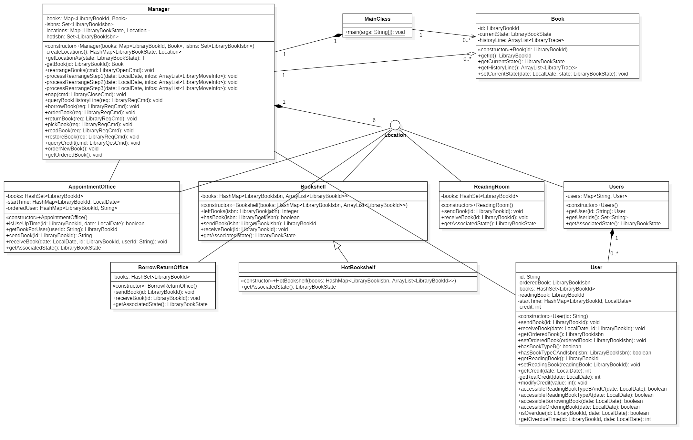
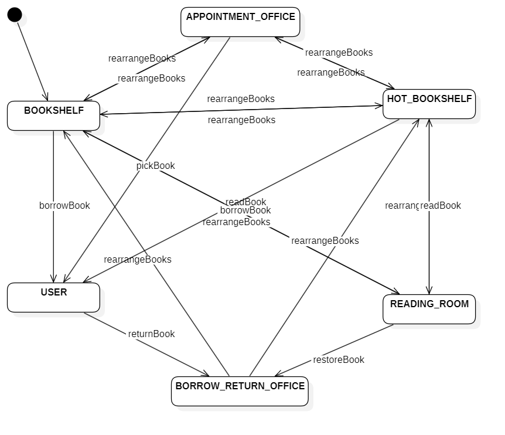
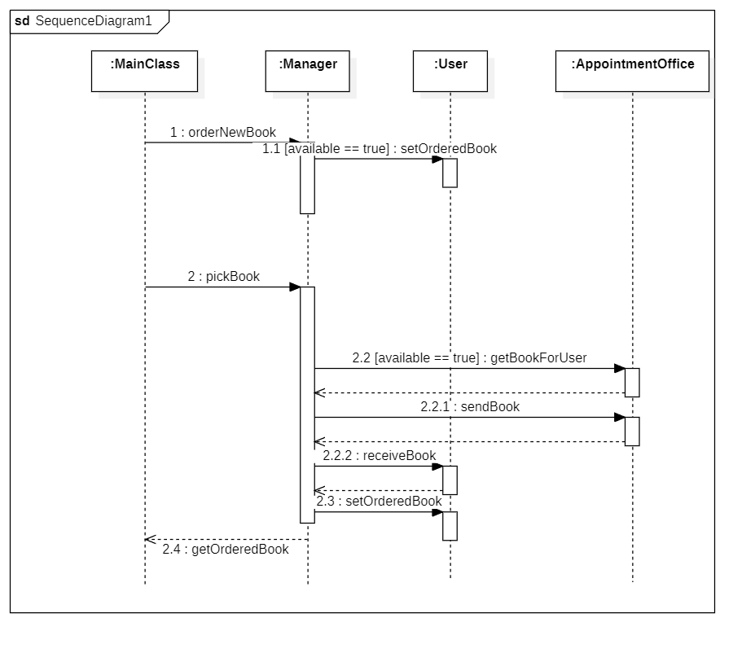

# 
  BUAA_2025_OO_Unit4 单元总结

本单元的核心任务是以一个图书馆管理系统为背景, 锻炼 **对程序架构的设计和抽象** 能力, 以及 **UML建模** 能力.

---

## 正向建模与开发 和 架构设计

本单元简单实践了 **类图,状态图和顺序图** ,这一部分也将以这三个图展开.

### 正向建模与开发

**正向建模与开发** 是一种从高层次的抽象模型(如需求和设计图)出发, 逐步求精和转换, 最终生成系统代码的软件开发方法. 简单来说,它的路径是: **需求 → 分析 → 设计 → 编码**.这与从现有代码中提取模型的“逆向工程”正好相反.

正向建模与开发有诸多优点:
* 正向建模一般使用UML图这样的 **可视化** 图形语言, 在工程系统展现的直观性上遥遥领先, 甚至于客户都能理解. 这对各方的沟通交接有独特优势.
* **强制性地架构思考** 促使开发者从全局或者说高层次去思考系统架构, 模块划分与接口设计等. 这可以在早期就发现一些设计缺陷, 也有利于构建健壮性与扩展性更优的系统.
* 设计模型本身就是系统最核心, 最准确的文档. 这使得新成员加入或面临功能修改时可以通过查阅模型快速理解系统结构和设计意图, **可维护性佳**.

当然, 这种"三思而后行"的方法也是有缺点的:
* **前期开销大，见效慢**: 在项目初期需要投入大量时间和精力来创建, 评审和完善模型. 这导致很长一段时间都不会有代码产出.
* **模型与代码同步困难**: 在开发过程中, 需求变更或技术实现上的调整, 往往会直接在代码中修改, 但开发者可能会忘记或没有时间去同步更新设计模型. 久而久之, **模型就与实际代码脱节, 不再是"蓝图", 而是废纸**.
* **过度设计和分析瘫痪** : 由于建模与设计牵连的 **细节很多** , 在编码前如果把握不好分析的度, 可能陷入无休无止的设计中.
* **不适应快速变化的需求**: 与主流的当前敏捷开发有一定冲突. 严格的正向开发流程相当笨重, 而敏捷开发这种让设计人员不显式地写出设计文档, 而是脑内构思直接编码更能适应快速变化需求.

就本单元我浅薄的学习经验而言, 我认为正向建模与开发更像是一种 **重量级** 的方法, 追求用极致地 **可靠性** 去实现 **需求稳定的复杂系统** ~~(不来点这个你怎么知道你上的是北航)~~ .本单元新增需求的时候可能对需求稳定也有所倾向, 即所有的新增需求并没有推翻先前的需求, 而是纯纯的增量; 然而, 对于这样一个不太大, 也不太复杂的系统, 正向开发其实没能发挥出高可靠性的威力.

### UML图与架构设计

三次作业的类图变迁如下:

##### **第13次作业:**
* `MainClass` 创建一个 `Manager` 和若干 `Book` , 所有的指令交给 `Manager` 处理
* `Manager` 与 `Book` 关联, 意思是 `Manager` 管理这若干 `Book` 的去向
* `Book` 管理自己的移动轨迹
* `Manager` 创建并依赖 `AppointmentOffice` , `User` , `BorrowReturnOffice` 和 `Bookshelf`
* 各存书处共通之处在于都有一个容器放书, 但使用的数据结构和创建的个数(User可以有若干个)有所不同

##### **第14次作业:**
* 在原有基础上进行了抽象: 用 `Location` 接口抽象, 所有存书处实现这个空接口
* 设计一个 `Users` 类, 管理一个容器 `users`
* 用 `HotBookshelf` 继承 `Bookshelf` , 二者并无实质性区别 ~~现在才发现bookshelf是一个词,而不是bookShelf~~
* 由于各存书处的 `books` 容器实现五花八门, 没有在 `Location` 处抽象; 只是加了个占位方法混测评

##### **第15次作业:**
* 主要修改在 `User` , 新增了很多方法
* 为了混测评加了几个关联关系, 我现在仍比较困惑我关联的关联为什么不能直接视为我的关联

##### **状态图和顺序图:**

状态图围绕 `book` 的转移展开:

顺序图则有点面向测评编程, 毕竟这种只考虑对不对, 不问你全不全的测评机制, 写得少就是容易过.
* `orderNewBook` 指成功预订书籍, 即预订请求到来 &rarr; 设置预约的书籍;
* `getOrderedBook` 指取到预订书籍, 即取书请求到来 &rarr; 验证书籍存在 &rarr; 从预约处取书送给用户 &rarr; 取消预约状态 &rarr; 返回成功取书消息

为了不改变我的程序而简易通关, 我的 `orderNewBook` 和 `getOrderedBook` 都只是占位方法

##### **架构特点**

这一部分最后介绍一些我认为我架构的一些特别之处

* 能够存书的位置并不直接与 `Book` 交互, 而是与它们各自的 `bookId(类型: LibraryBookId)` 交互; 各存书处间无关联, 只是 `Manager` 要求它们送书或者接书
* 只使用了一次整理, 因为书籍整理测评的检查时机实际只有开馆后, 这是一个偷懒的设计
* 用 `Location` 接口抽象, 所有存书处实现这个空接口: `Manager` 不再臃肿地拥有一堆存书处属性, 而是有一个 `locations` 容器属性, 并通过 `getLocationAs()` 来获取某位置
* 设计一个 `Users` 类: 一方面可以避免过多对象实现 `Location`, 另一方面备战了 `User` 分级的可能, 如本研学生借书权限不同或师生使用不同身份识别等需要继承 `User` 的场景
* 信用分的计算使用了"懒计算"(或者叫延迟计算, Lazy Evaluation):
  * 常规做法是, 每个开闭馆中有一次主动的书籍检查, 发现逾期就立即修改用户的 `credit` 字段. 这种做法非常主动, 但不高效; 同时在更多分数修改需求加入时复杂性骤增.
  * 我的做法是, 只有 **离散的增减分** 和 **连续的增减分结算** 时真正修改 `credit` 字段, 也就是即时结算的直接结算, 逾期只在还书时真正扣分; 这种混合策略区分了离散事件与连续事件. 这在可维护性, 可扩展性和性能上都有优势.
  * 具体来说, 我将"用户在某个特定日期的实时信用分"理解为一个派生属性, 依赖于 `credit` , `books` 和 `startTime` 这些存储属性, 由 `getRealCredit(date)` 得到.
* 尽量将判断条件封装为函数,哪怕只有一行, 这有利于后续可能的调整

### 追踪关系

追踪关系指的是在软件开发过程中,  **从需求追溯到设计, 再从设计追溯到代码或测试等产物的能力**. 具体到这个单元来说, 就是UML模型元素与程序代码之间的对应关系.

举一个例子解释追踪关系:

| 类图         | 对应/追踪到的代码实现  | 示例说明  |
|--------------|--------------------------------------|------------------------------------------------------|
| 类           | Java 类 (public class ...)           | User 类图 -> User.java 文件                           |
| 属性         | 类的成员变量 (private String name;)   | User 类的 id 属性 -> User 类中的 id 成员变量           |
| 操作         | 类的方法 (public void doSomething())  | User 类的 orderNewBook() 操作 -> User 类中的 orderNewBook() 方法 |
| 关联关系     | 类的成员变量（对象引用）               | User 与 Book 的预定关系 -> User 类中有 List<Book> orderedBooks; |

### 大模型辅助正向建模

这一部分讨论引导大模型完成复杂架构设计的策略. 我认为, 核心思想是放弃"一问一答"的模式, 转而采用一种 **结构化、迭代式、充满反馈的对话式设计流程** . 作为人类的我不是提问者, 而是整个设计过程的 **引导者 验证者 决策者**. 

##### **1. 角色扮演与情景预设**

这是与大模型协作的第一步, 也是最关键的一步. 在提出任何实质性问题之前, 必须为其精准设定角色并注入完整的上下文.

* **如何做:** 对话开始时, 使用一段明确的指令来“初始化”模型.
* **示例 Prompt:**
    > “你将扮演一位经验丰富的软件架构师, 你的任务是与我合作, 共同设计一个可扩展的大学图书馆管理系统. 该系统需要支持数万名学生和数百万册书籍(规模是瞎写的); 核心功能包括用户管理书籍检索, 借阅, 归还, 预定和信用分体系等. 注意遵守设计原则, 如模块化, 高内聚低耦合. 在接下来的所有讨论中, 始终基于记住这一身份.”
* **另一个 Prompt:** 当然, 也可以简单地让大模型知道你是个学生, 你在做作业, 它要帮你设计框架(其实这样更省事).

此举不仅定义了模型的身份，更重要的是明确了**设计目标, 规模和核心设计原则**，为后续所有设计决策提供了依据。

##### 2. 分解任务与迭代式提问

对于架构设计这类复杂任务, 指望通过一个宏大的问题(如"你给我设计一个图书馆管理系统")得到理想结果是不切实际的. 正确的方法是将庞大的设计任务分解为一系列逻辑连贯且循序渐进的子任务, 通过连续的迭代式提问来逐步构建和完善整个架构.

* **如何做:** 将架构设计从宏观到微观分解为多个层次，逐层深入。
* **迭代过程示例:**
    1.  **宏观分层**：“基于我们设定的目标，首先请为该图书馆管理系统提出一个高层架构分层方案。例如，可以考虑经典的三层架构或者其他，解释你推荐的理由。”
    2.  **核心模块识别**：“采用分层架构。现在，聚焦于业务逻辑层，识别并列出实现核心功能所必需的关键模块或服务（例如：用户中心、书籍中心、借阅流程服务、库存管理服务等）。”
    3.  **类与关系设计**：“接下来，我们深入‘借阅流程服务’这个模块。设计其核心的UML类图，注意已经分析出来的类都要存在。你需要用PlantUML语法表示出它们之间的关系和类的方法属性。”
    4.  **关键交互建模**：“现在，基于你设计的类图，使用UML顺序图来建模一个完整的‘用户成功借阅一本书’的交互流程。请确保交互的逻辑严谨，符合我们高内聚低耦合的原则。”
* **关于这个示例:** 是让 AI 提取对话然后生成的，实际对话过程轮次更多。

通过这种方式，每一步的输出都更具体、更可控，也便于我们及时对设计方向进行评估和调整。

#### 3. 提供明确的输入和输出格式

为了让大模型的输出更具可用性, 避免"叽里咕噜说什么呢"的尴尬, 我们可以主动规定其回答的格式.

* **如何做**：在提问时明确要求模型使用特定的语法或格式进行回答.
* **示例**:
    * **代码/脚本类:**"使用 **PlantUML** 语法生成该类图."
    * **对比分析类:**"解释你用的优化策略, 用 **表格**的形式对比与原代码的差异.”
    * **代码实现类**：“请为 `Manager` 类生成一个 **Java** 的代码骨架, 生成带注释和不带注释的两个版本.”

#### 4. 反馈与批判性修正

* **如何做:**当发现模型输出有问题时, 需要指出错误并尽可能解释原因.
* **注意:** 如果已经意识到 AI 猪脑过载了, 反复要求修改模型只会拆东墙补西墙越改越烂, 应当做的是赶紧转人工.

---

## 思维演进

### 架构思维

回顾OO课程的四个单元, 我们依旧能够发现有这么一条线: 从面向对象基础, 到多线程并发, 再到契约式开发, 最终迈向模型驱动的顶层设计成长路径.

### 测试思维

我想先介绍一下四个单元进行的测试方法.
* 第一单元: 更多使用的是脑测和瞪眼法, 手搓一些边界数据
* 第二单元: 本单元使用了测评机进行"轰炸", 其实很契合多线程并发这种不稳定触发的 bug 的单元; 在抛出 bug 之后结合具体测试点找原因, 再手搓类似测试点
* 第三单元: JML 规格本身就是一个很强大的 debug 标准, 真正符合了 JML 规格, 就一定不会出现正确性问题; 关于性能方面, 使用大模型阅读代码, 找一些复杂度高的拉出来手搓测试点; 同时, 本单元要使用 JUnit 测试, 这个单元也学习了测试相关的理论(JUnit真能测出bug!!!曾经JUnit过了但是程序没过中测QAQ)
* 第四单元: 由于正向开发就是特别稳定有这样的特点, 所以这个单元如果设计了非常好的 UML , 想出错还是很难的

从思维演进的角度看, 我的测试方法经历了一个从混沌到有序,从被动到主动的完整演变.

最初在第一单元, 测试尚处于原始的"手工作坊"阶段, 依赖直觉和肉眼进行黑盒验证. 第二单元的多线程挑战, 则迫使我拥抱了"工业化"的自动化测评机, 思维转向了如何通过规模化,高强度的黑盒轰炸来暴露和复现偶现的 bug.

而第三单元的 JML 和 JUnit 是一次质的飞跃, 让我真正进入了"现代化"的白盒测试领域, 明白了测试的核心是验证代码是否遵守 **"契约"** , 而不仅是表现正确. 最终在第四单元, 思维升华到了 **"防患于未然"** 的境界"最好的测试始于最优秀的设计. 当模型经过深思熟虑, 测试便从"亡羊补牢"式的寻找错误, 转变为对高质量设计的验证和信心确认.

---

## 课程学习体会

回首这门贯穿整个学期的面向对象课程, 我想其带给我最大的收获, 并非仅仅是 Java 语言的熟练, 几种设计模式的掌握, 或是 UML 图的绘制方法, 而是**一种思维方式的彻底重塑** - 是从一个仅仅关注功能实现的"代码编写者", 向一个具备初步工程化思想的"系统设计者"的蜕变.

这门课程通过四个层层递进的单元, 为我带来了思想上的"四重洗礼":

* **第一单元**教会了我**分解**. 面对复杂的表达式, 我第一次不再将所有逻辑堆砌一处, 而是学习将问题拆解为具备明确职责的对象, 这是我面向对象思想的启蒙.
* **第二单元**教会了我**同步**. 面对多线程电梯的并发交互, 我开始真正理解线程安全, 锁与协作的复杂与精妙, 思维从线性的, 确定的世界, 迈入了并行的, 充满不确定性的挑战.
* **第三单元**教会了我**守约**. 面对 JML 的严格规约, 我深刻体会到了"契约式设计"的严谨之美. 代码不再是天马行空的创造, 而是在严格的契约下, 寻求正确性与高性能之间极致平衡的艺术.
* **第四单元**教会了我**建模**. 面对一个完整的系统, 我学会了后退一步, 用更宏观的视角进行自顶向下的设计. UML 不再是课本上遥远的概念, 而是成为了指导我从蓝图走向实现的, 必不可少的思考工具.

与此同时, 我的测试思维也完成了从"手工作坊"到"防患于未然"的演进. 我认识到, **测试不是编码的附属品, 而是与设计和实现同等重要的核心环节**. 高质量的系统, 是在设计的源头注入的, 而非在发布的终点测出的. 而对大模型等现代工具的探索, 也让我明白了AI时代下工程师的新角色: 我们不再是单纯的执行者, 而是驾驭和引导强大工具的**决策者**与**思想者**.

诚然, 这门课程的过程充满了挑战, 有面对复杂需求时的茫然, 有深夜debug的痛苦, 也有为了通过测评而"曲线救国"的挣扎. 但正是这些经历, 共同构成了OO这门课程这份独特而宝贵的体验. 它所锤炼出的抽象能力, 架构思维和工程素养, 我相信, 已经为我未来的学习, 科研乃至职业生涯, 打下了最为坚实的地基.